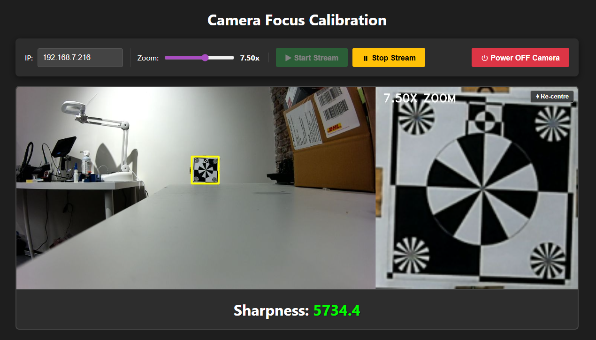
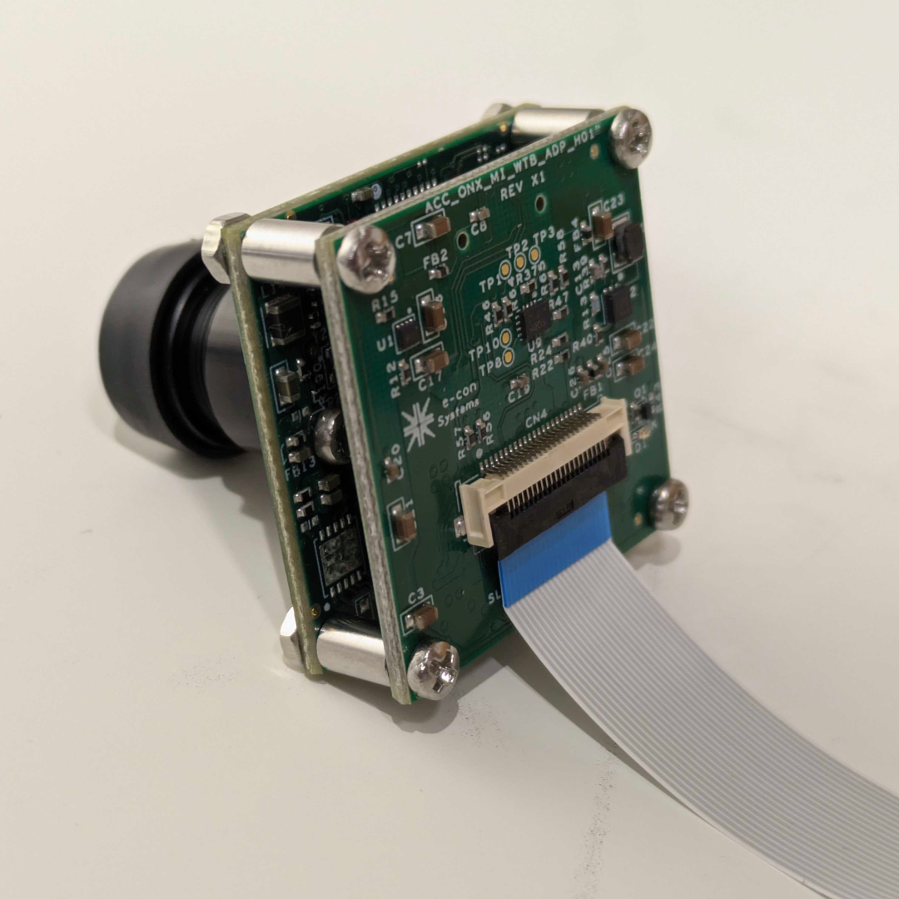
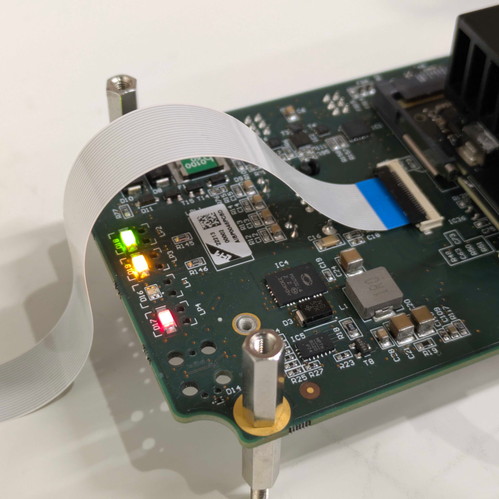

# Camera Focusing Tool
Python script running a Flask browser app for focusing camera modules. It uses a [Laplacian-based method](https://opencv.org/autofocus-using-opencv-a-comparative-study-of-focus-measures-for-sharpness-assessment/) within OpenCV to score the sharpness of an image. This score can be used to mount the camera lens in an optimal position.

The zoom level is adjustable, and the focusing area (yellow square) can be moved around by dragging. Only the yellow square area is used to calculate the sharpness.
.

## How to set up
Clone the repository and create a virtual environment, then install the required packages listed in `requirements.txt`.

```
# Create virtual environment
python -m venv venv

# Activate it
source venv/bin/activate        # macOS / Linux
# OR
venv\Scripts\activate           # Windows

# Install dependencies
pip install -r requirements.txt

# Run the Flask web app
python .\app.py

# The app opens on https://127.0.0.1:5000 by default
```


## Procedure for Blox S

1. Make sure the carrier board is not powered (all LEDs off).
2. Insert the FFC (Flat Flexible Cable) in the camera module. Ensure correct orientation (blue stiffener facing outwards).
3. Connect a PoE (Power over Ethernet) capable cable to the carrier board. The red LED should light up, indication power.
4. Wait until the yellow LED (ETH link) turns on and the green LED (ETH activity) start flickering. Now the system is operational and should show up on the network router. Note the IP address.
5. Enter the correct IP address and click the `Start Stream` button in the web app. A live video feed should be visible now. Zoom in on the focusing tile.
6. Remove the lens cap. Rotate the lens until the sharpness looks good (score exceeding ~4000). Don't make fingerprints on the lens!
7. Fix the lens into place using Polyimide tape (Kapton). Put the lens cap back when finished and add a green sticker on the camera module to indicate status.
8. Click `Power OFF Camera` and wait until the yellow & green LEDs turn off. Then remove Ethernet cable. When the red LED is off, remove the camera module.
9. Repeat

|  |  |
| --- | --- |
| _Camera module connection_ | _Carrier board connection & LEDs_ |

> [!WARNING]
> Do not make fingerprints on the camera lens. Use cotton gloves. Only remove the lens cap when needed.
